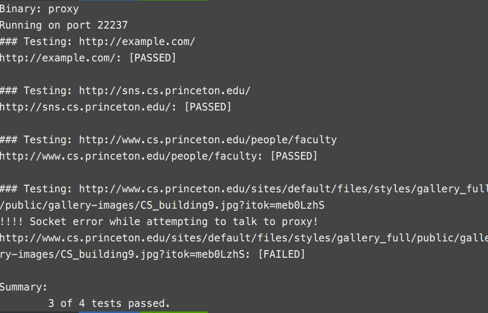
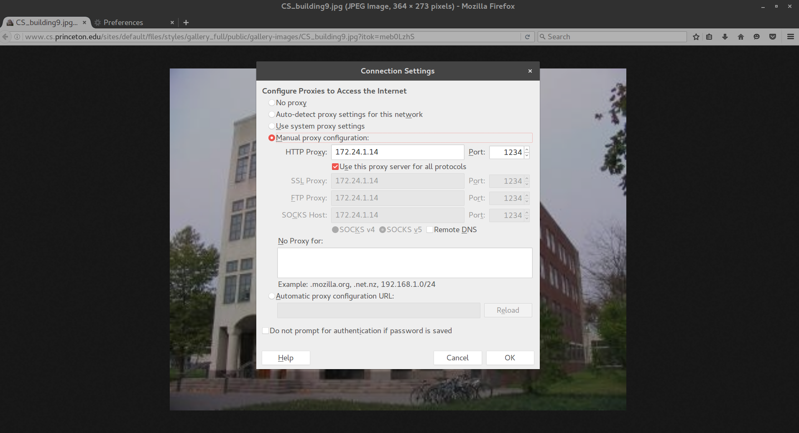
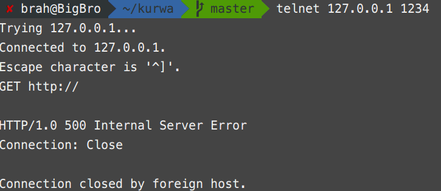
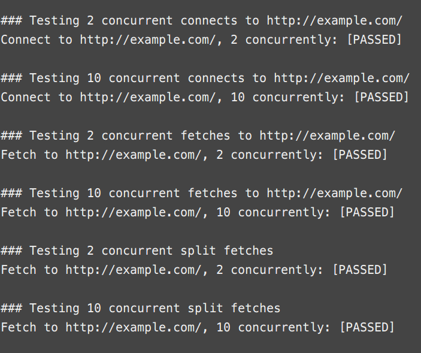
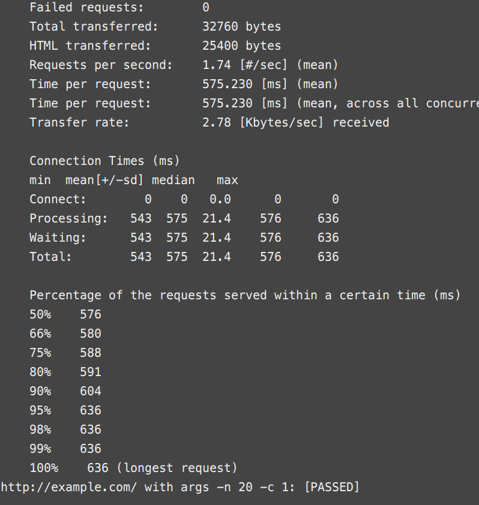
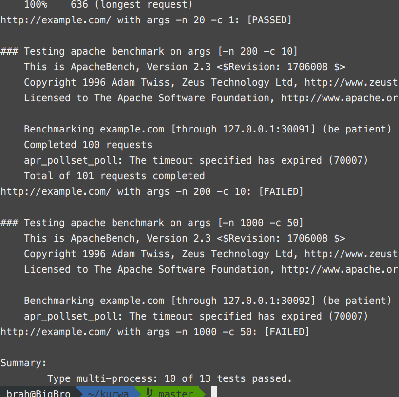

# HTTP/1.0 Proxy Server

A simple Http proxy Server implemented in c++

## Implemented Options

1. A Http/1.0 Proxy Server
2. Flexibility to provide port number as a command line argument
3. Error handling in the form of (Error 500)
4. Ability to handle concurrent connections via child processes
5. Cap on number of child processes to avoid DDOS attacks

## Deployment

1. Build
    > make
	> > -- Creates a binary named proxy

2. Run
    > proxy 1234
    > > Starts the proxy server listening on port 1234.
    > > > Port number is the first argument and is optional (Defaults to 1234)

3. Connection to proxy can be established in multiple ways.
    Currently working pathways have been listed below
    + Configuring proxy in firefox.
    + Using proxy extension (omega proxy switcher) in chrome.
    + Telnet to connect to proxy and there by make http requests.

## Design Choices

1. Buffer length 4096 (hence the request is bounded to be 4096)
2. Maximum 20 concurrent requests are allowed to the server
3. All errors are reformed as Internal Server Errors
4. To handle split requests the request end is read as two simultaneous ‘/r/n’

## Testing

There are two python scripts in *Misc* directory. They take *proxy* as their first argument.
Just execute them as 
> python Misc/proxy_tester.py proxy

> python Misc/proxy_tester_conc.py proxy

**Note** It might be necessary to install apache2-utils, otherwise the apache benchmarks in test 2 won't run. If you see *ab* not found then on ubuntu 16.04.3 install it as follows
> sudo apt-get install apache2-utils

## Results
1. Currently using the proxy_tester.py, only 3 out of 4 cases pass.

2. But the fourth case passes successfully in a browser.

3. 500 Internal error for mal formed request

4. Concurrent requests are gracefully handled

5. Apached Benchmars
    + Only one out of the four benchmarks works on slower networks. 
    + In the cse network other pass out too.

6. Anamolies
    + To pass the 4th case, adding a wait helps after sending 
    + 10/13 cases pass in the 2nd script

